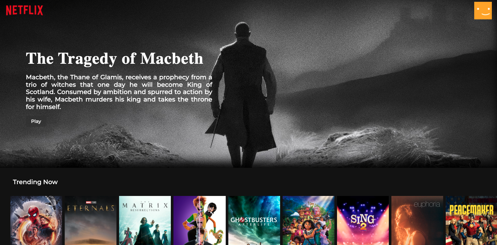
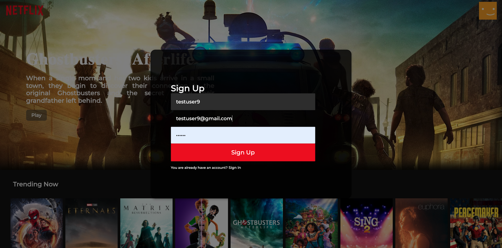
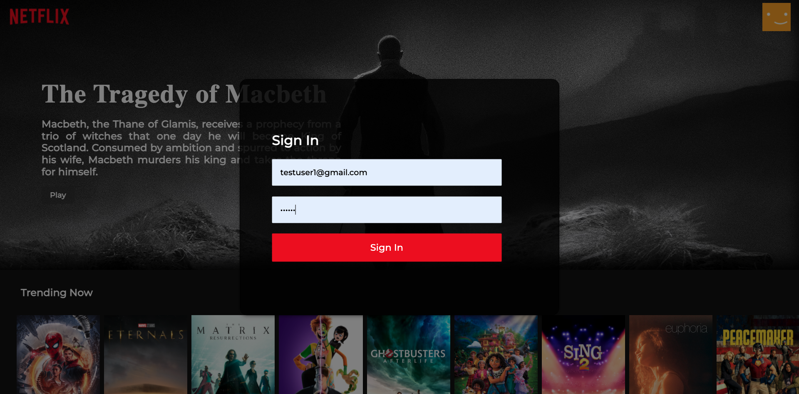
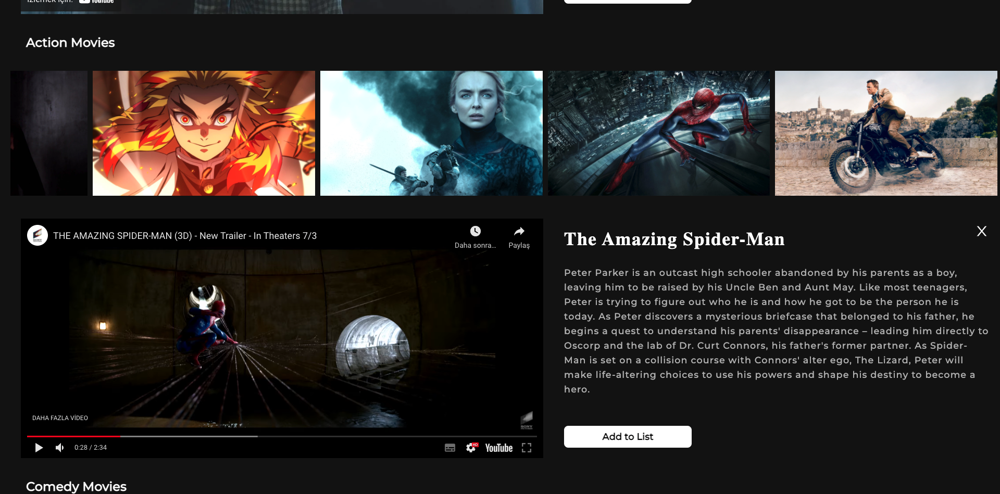
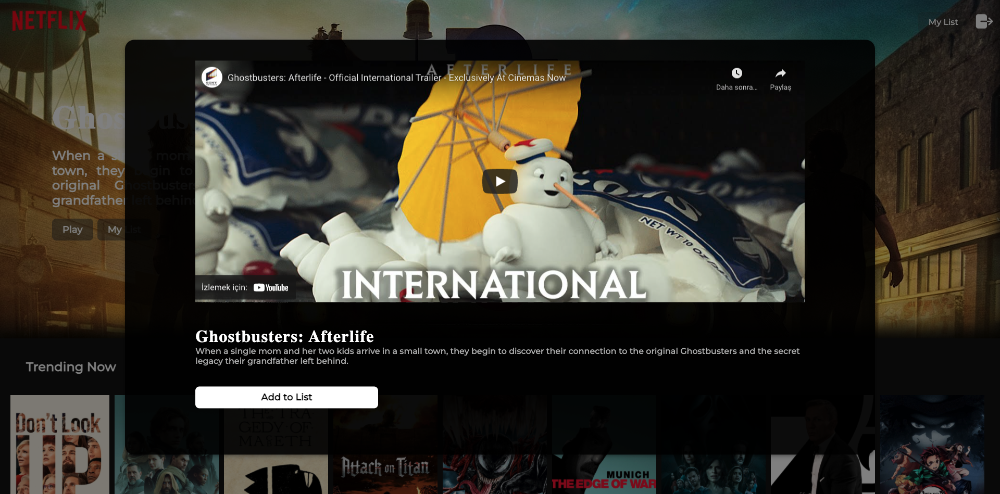
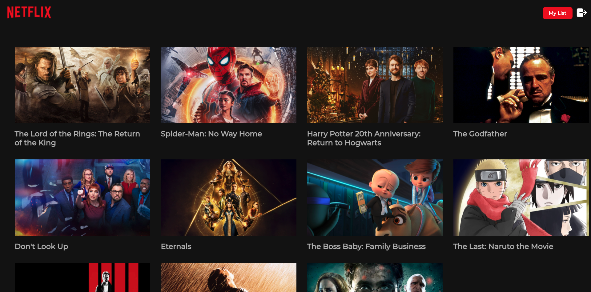
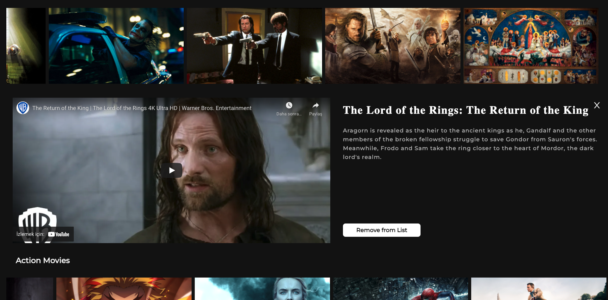

# Netflix Clone With ReactJS 🍿🎬

## Demo Website

### 👉🏻 Heroku: https://netflixclone-app.herokuapp.com
## Installation ⚡

<ul>
<li>
Get a free API Key at ➡️ 
<a href="https://developers.themoviedb.org/3/getting-started/introduction">
TheMovieDatabaseAPI
</a>

<li> 

npm

<pre>
<code>npm install npm@latest -g
</code></pre>
    </li>
    <li>

Clone the repo

<pre>
<code>git clone https://github.com/esrasen9/netflix-clone</code>
</pre>
<li>

Install npm packages

<pre>
<code>npm install</code>
</pre>
</li>
<li>
Get your firebase config details by creating a free project on
<a rel="stylesheet" href="https://firebase.google.com">Firebase</a>.
</li>
 
<li>
Enter your firebaseConfig object in firebase.js
 <pre>
const firebaseConfig = {
    apiKey: "",
    authDomain: "",
    projectId: "",
    storageBucket: "",
    messagingSenderId: "",
    appId: ""
};
</pre>
</li>
</ul>

## Screenshots :camera_flash:

